# RMEDIATECH SOVEREIGN PLATFORM

> **Autonomous Edge Infrastructure, Distributed Systems Arsenal & Sovereign Communication Architecture**  
> *Official Public Technical & Informational Documentation*

---

## 🌐 Executive Summary

The **RMediaTech Sovereign Platform** is a commercial-grade edge computing and distributed systems infrastructure designed for high-assurance, low-latency environments. Built from first principles around sovereign computing standards, the platform provides organizations and independent operators with standalone, autonomous tooling that operates completely free from third-party telemetry, commercial tracking networks, and vendor lock-in.

This repository serves as the official public documentation and reference index for platform capabilities, security standards, and architectural conventions.

---

## 🏛️ Platform Architecture Pillars

```
+-------------------------------------------------------------------------+
|                  RMEDIATECH SOVEREIGN PLATFORM                          |
+-------------------------------------------------------------------------+
|  [COMMUNICATION LAYER]       [EDGE RUNTIME]        [INTELLIGENCE ARSENAL]|
|  - Real-Time Media Ingestion - Zero-Dependency Exec - Multi-Vector Recon  |
|  - Encrypted Signaling Hub   - Self-Contained Dist  - Airspace Telemetry  |
|  - Low-Latency SFU Mesh      - Sandboxed Execution  - Protocol Forensics  |
+-------------------------------------------------------------------------+
|                      DATA SOVEREIGNTY STANDARD                          |
|         0% Third-Party Trackers | 100% Local Cryptographic Verification  |
+-------------------------------------------------------------------------+
```

### 1. Radical Zero-Trust Security
All operational interactions across the platform enforce radical verification boundaries. Assets, communications, and telemetry events are locally signed and validated without relying on external certificate authority chains or opaque third-party verifiers.

### 2. Autonomous Operational Continuity
Platform utilities are architected to maintain 100% operational viability in air-gapped, degraded, or zero-connectivity network topographies. When wider wide-area network connectivity is severed, local cluster coordination persists autonomously.

### 3. Pristine Privacy & Telemetry Hygiene
The entire platform adheres to a strict Zero-Telemetry guarantee:
- **No external analytics scripts or trackers**
- **No remote pixel beacons or fingerprinting libraries**
- **No third-party CDN asset loading**
- **Zero data exfiltration or silent diagnostic callbacks**

---

## ⚡ The Sovereign Frontier: Emancipation from the Old Empire

Modern software development has been colonized by digital feudalism. Independent builders and startups are told that operating a legitimate, high-availability platform requires renting a fragmented archipelago of middleman SaaS vendors:

```mermaid
flowchart LR
    subgraph OldEmpire ["🏰 The Old Empire (Digital Feudalism)"]
        direction TB
        CloudDB["Cloud DB (AWS RDS / Supabase)\n💸 $150 - $1,200/mo Rent"]
        CloudProxy["Edge WAF (Cloudflare / Fastly)\n🔒 Telemetry Lock-in & Tolls"]
        CloudAuth["Auth SaaS (Auth0 / Clerk)\n🔑 Identity Hostage Pricing"]
        CloudLog["Observability (Datadog / Splunk)\n📈 Exponential Ingestion Markup"]
    end

    subgraph SovereignFleet ["⚡ The Frontier Developer Blueprint (RMediaTech)"]
        direction TB
        BastionMesh["Bastion & WireGuard Mesh\n🛡️ Bitwise Radix Tries (<5ns Rejection)"]
        PropyleaIngress["Propylea & Phylax Ingress\n🏛️ Pure Rust L7 Proxy & Tarpits (<15MB RSS)"]
        SovereignLedger["Sovereign-Ledger\n⛓️ SHA-256 Merkle Provenance & Tamper Evidence"]
        LocalEngines["Bare-Metal NVMe WAL Engines\n🚀 0.00ms Jitter · 100% Owned Persistence"]
    end

    OldEmpire -.->|"The Emancipation Blueprint"| SovereignFleet
```



### 💎 Sovereign Independence vs. Cloud Monopolies

1. **Financial Emancipation**: Eliminates the $500–$3,000/month baseline cloud burn rate before a single customer signs up. Compute runs lean on low-cost bare-metal or sovereign unmanaged VPS nodes.
2. **Defensive Asymmetry**: Replaces recurring third-party WAF subscriptions with pure-mathematical in-memory shields ([`phylax`](https://github.com/xuoxod/phylax), `bastion`).
3. **Cryptographic Assurance**: All mission-critical state transitions and audit trails are permanently anchored to a rolling SHA-256 Merkle blockchain (`sovereign-ledger`), eliminating opaque third-party logging bills.
4. **Absolute Architectural Ownership**: 100% pure static Musl binaries, zero dynamic glibc dependencies, zero vendor telemetry, zero lock-in.

### 🧬 Methodology: Autonomous Human-AI Systems Engineering

The RMediaTech platform is built upon a transparent, proud engineering foundation: **sovereign human-AI pair programming**. 

Rather than hiding behind opaque claims or generating fragile automated boilerplate, the platform is architected through intense, hands-on collaboration between a human systems lead and an agentic cognitive partner. Human vision enforces the non-negotiables—zero-telemetry, strict Content Security Policies, memory safety, and cryptographic provenance—while collaborative intelligence accelerates verification, edge-case hardening, and low-level algorithmic optimization. This represents the frontier of modern development: human architectural sovereignty magnified by artificial intelligence.

---

## 📚 Namespaced Documentation Index

| Document | Scope & Focus | Description |
| :--- | :--- | :--- |
| [`PLATFORM_OVERVIEW.md`](docs/PLATFORM_OVERVIEW.md) | `rmt::platform` | High-level system topology, tenant isolation, and service layers |
| [`OPERATIONAL_SECURITY_STANDARDS.md`](docs/OPERATIONAL_SECURITY_STANDARDS.md) | `rmt::security` | Defense-in-depth protocols, Content Security Policy, and cryptographic standards |
| [`SYSTEMS_ARSENAL_SPECIFICATION.md`](docs/SYSTEMS_ARSENAL_SPECIFICATION.md) | `rmt::arsenal` | Functional capabilities of companion edge utilities and forensic tooling |
| [`DATA_SOVEREIGNTY_AND_COMPLIANCE.md`](docs/DATA_SOVEREIGNTY_AND_COMPLIANCE.md) | `rmt::compliance` | Governance policies, data ownership rights, and zero-telemetry verification |

---

## 🛡️ Systems Arsenal Capabilities

The platform coordinates a unified family of purpose-built edge utilities:

- **Bastion**: Tactical network discovery, port inspection, and layer-2/layer-4 boundary verification.
- **Conduit**: Sovereign zero-trust tunneling, remote node bridging, and encrypted enclave interconnectivity.
- **Forgetunnel**: Ephemeral outbound proxy routing and privacy-preserving transport tunnels.
- **Nexus-Recon**: High-speed network reconnaissance and active node mapping.
- **Sentry-Edge**: Perimeter monitoring, real-time threat detection, and telemetry alerting.
- **Sovereign-Ledger**: Cryptographically verifiable local audit logging and event serialization.
- **RMailer**: Standalone, tracker-free transactional mail dispatch and operational notifications.
- **Ostium**: Autonomous gateway sentinel, Qualcomm hardware fingerprinter, and 802.11w WIDS wardriving defense platform.

---

## ⚖️ Legal & Operational Notice

The software, documentation, and tooling referenced herein are provided strictly under commercial terms for authorized administrative, operational, and research purposes. Operators are exclusively responsible for regulatory compliance, jurisdictional adherence, and network authorization within their respective operational spheres.

&copy; 2026 RMediaTech. All Rights Reserved. Sovereign Edge Platform.
